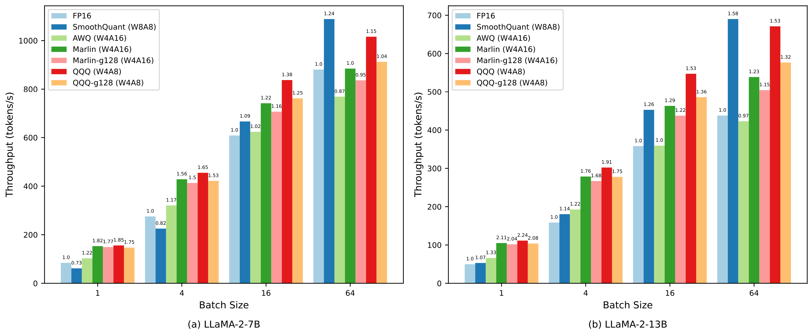

# QQQ: Quality Quattuor-Bit Quantization for Large Language Models
[[Paper](https://arxiv.org/pdf/2406.09904)]

Quantization is a proven effective method for compressing large language models. Although popular techniques like W8A8 and W4A16 effectively maintain model performance, they often fail to concurrently speed up the prefill and decoding stages of inference. W4A8 is a promising strategy to accelerate both of them while usually leads to a significant performance degradation.
To address these issues, we present QQQ, a **Q**uality **Q**uattuor-bit **Q**uantization method with 4-bit weights and 8-bit activations. QQQ employs adaptive smoothing and Hessian-based compensation, significantly enhancing the performance of quantized models without extensive training.
Furthermore, we meticulously engineer W4A8 GEMM kernels to increase inference speed. 
Our specialized per-channel W4A8 GEMM and per-group W4A8 GEMM achieve impressive speed increases of **3.67x** and **3.29x** over FP16 GEMM.
Our extensive experiments show that QQQ achieves performance on par with existing state-of-the-art LLM quantization methods while significantly accelerating inference, achieving speed boosts up to **2.24x**, **2.10x**, and **1.25x** compared to FP16, W8A8, and W4A16, respectively.

## News or Update
- [2024/07/31] **Update!!!** The QQQ quantization method has been successfully integrated into the **official vLLM**. For more details, please refer to our merged [[PR](https://github.com/vllm-project/vllm/pull/5218)]. 
- [2024/07/17] We put `quant_config.json` in the entry `quantization_config` of model's `config.json`. 
- [2024/06/17] We release the QQQ [paper](https://arxiv.org/pdf/2406.09904) on arXiv.
- [2024/06/03] We release the QQQ code at this repository.

## Install
### Prerequisites
- Your GPU(s) must be of Compute Capability 8.0 or higher. Amphere and later architectures are supported.
- Your CUDA version must be CUDA 11.4 or later.
- Python 3.9+
- Transformers 4.36.2
- lm_eval 0.4.2
### Build from source
Currently this repo only support build form source. We will release package soon.

```
git clone https://github.com/HandH1998/QQQ.git
cd QQQ
pip install -v -e .
```

## Supported models
Model support list:

| Models   | Sizes                       |
| ---------| ----------------------------|
| LLaMA-1  | 7B/13B/30B/65B              |
| LLaMA-2  | 7B/13B/70B                  |
| LLaMA-3  | 8B/70B                      |

## Usage
### Quantize model
Here is an example for quantizing a LLaMA model with per-channel weight quantization.
```
python3 examples/quant_model.py \
--model_path ${model_path} \
--tokenizer_path ${tokenizer_path} \
--batch_size 8 \
--dtype float16 \
--quant_config quant_config/llama/w4a8.yaml \ # uses quant_config/llama/w4a8-pergroup.yaml for per-group weigth quantization
--save_path ${save_path}
```
### Evaluate Model
Here is an example for evaluating perplexity on WikiText2 and accuracy on some zero-shot tasks.
```
python3 examples/eval_model.py \
--model_path ${quantized_model_path} \
--tokenizer_path ${tokenizer_path} \
--tasks piqa,winogrande,hellaswag,arc_challenge,arc_easy \ # lm_eval tasks
--eval_ppl \ # whether evaluate perplexity on WikiText2
--batch_size 8 \
--max_length 2048 
```
### Inference
- inference with vLLM 

  We recommand to infer with vllm for a faster speed. Refer to this [PR](https://github.com/vllm-project/vllm/pull/5218). Here is an offline inference example.
  ```
  from vllm import LLM, SamplingParams

  # Sample prompts.
  prompts = [
      "Hello, my name is",
      "The president of the United States is",
      "The capital of France is a",
      "A pig",
  ]
  # Create a sampling params object.
  sampling_params = SamplingParams(temperature=0.8, top_p=0.95)
  model = your_quantized_model_path
  tokenizer = your_tokenizer_path

  # Create an LLM.
  llm = LLM(
      model=model,
      tokenizer=tokenizer,
  )
  # Generate texts from the prompts. The output is a list of RequestOutput objects
  # that contain the prompt, generated text, and other information.
  outputs = llm.generate(prompts, sampling_params)
  # Print the outputs.
  for output in outputs:
      prompt = output.prompt
      generated_text = output.outputs[0].text
      print(f"Prompt: {prompt!r}, Generated text: {generated_text!r}")

  ```
  

- inference in this repo

  Our inference script only supports simple text completion for base model like llama-2-7b-base. If you want to do the inference with chat model like llama-2-7b-chat, you should modify our script following the offical guidance. Specifically, you need to add a chat template to your prompt.
  ```
  python3 examples/test_model.py \
  --model_path ${quantized_model_path} \
  --tokenizer_path ${tokenizer_path} \
  --prompt "Are you a pig?" \
  --max_new_tokens 128
  ```

## Key results
### Model performance
We evaluated the model performance on WikiText2 and five zero-shot tasks.

### Throughput
We conducted the same-batch throughput comparison of quantized LLaMA-2 models under various batch sizes. The input sequence length is 1024 and the output sequence length is 128.

### W4A8 GEMM performance
Here is the speedup over PyTorch FP16 GEMM (Calling CUTLASS) of all GEMMs under different numbers of input tokens. The weight matrix size is (N=8192, K=21760).


## Acknowledgement
- Special thanks the **GPTQ Team** for proposing **GPTQ** algorithm and open source the [code](https://github.com/IST-DASLab/gptq), and for releasing [Marlin kernel](https://github.com/IST-DASLab/marlin) which our W4A8 GEMM refers to.
- Special thanks the **Outlier Suppression Plus Team** for proposing **Outlier Suppression Plus** algorithm and open source the [code](https://github.com/ModelTC/Outlier_Suppression_Plus/tree/main).

## Reference
If you find QQQ useful or relevant to your research, please cite our paper:

```bibtex
@article{zhang2024qqq,
      title={QQQ: Quality Quattuor-Bit Quantization for Large Language Models}, 
      author={Ying Zhang and Peng Zhang and Mincong Huang and Jingyang Xiang and Yujie Wang and Chao Wang and Yineng Zhang and Lei Yu and Chuan Liu and Wei Lin},
      journal={arXiv preprint arXiv:2406.09904},
      year={2024}
}

```
